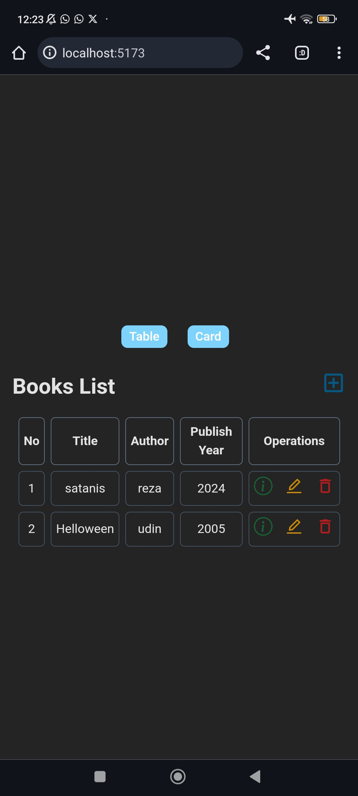

# 📚 Bookstore MERN Stack

A simple Bookstore app built using **MERN Stack** (MongoDB, Express.js, React.js, Node.js). This project is created as a learning exercise to understand the full-stack development process and CRUD functionality.

---

## 🚀 Features

- 📖 Add new books
- ✏️ Edit book details
- 🗑️ Delete books
- 📋 View book list

---

## 🧪 Tech Stack

- **Frontend:** React.js
- **Backend:** Node.js, Express.js
- **Database:** MongoDB (via Mongoose)

---

## 📷 Preview



---

## 🛠️ Installation

### 📦 Backend Setup

```bash
cd backend
npm install
npm run dev

🌐 Frontend Setup

cd frontend
npm install
npm start


---

🔗 Live Demo

🚧 Coming Soon...
(You can deploy it to Netlify, Vercel, or Render and put the link here)


---

📂 Folder Structure

bookstore-mernstack/
├── backend/
│   ├── models/
│   ├── routes/
│   └── server.js
└── frontend/
    ├── public/
    ├── src/
    │   ├── components/
    │   ├── pages/
    │   └── App.jsx


---

🧑‍💻 Author

Ahmad Reza Pahlevi
🔗 GitHub Profile


---

📄 License

This project is licensed under the MIT License.

---

Enter- **Backend:** Node.js, Express.js
- **Database:** MongoDB (via Mongoose)

---

## 📷 Preview


---
